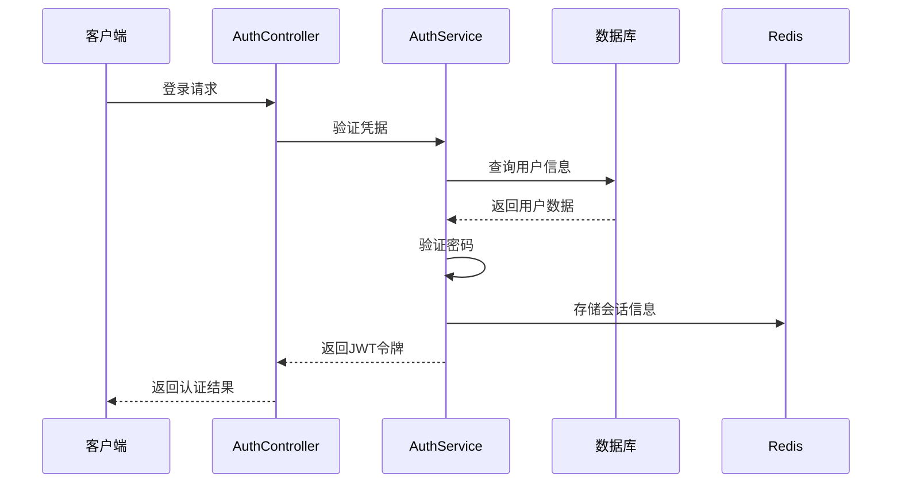
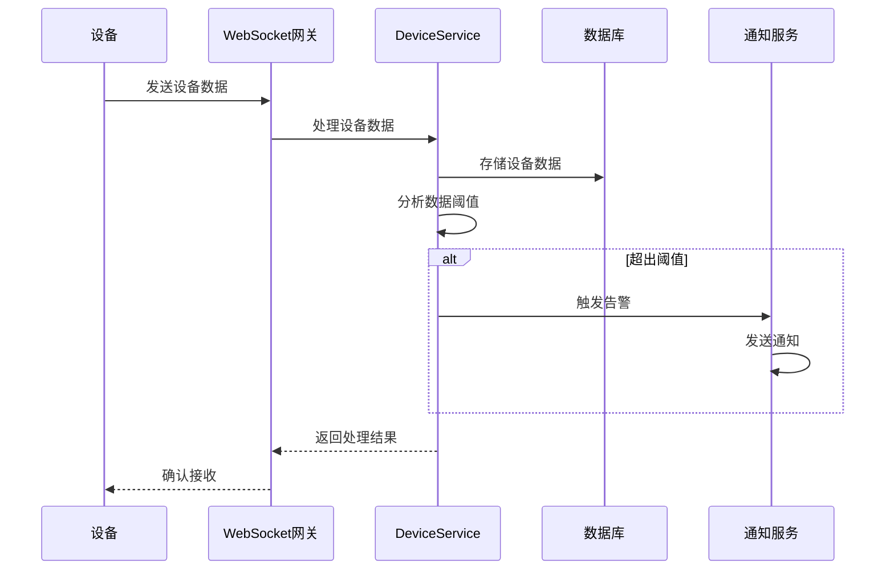
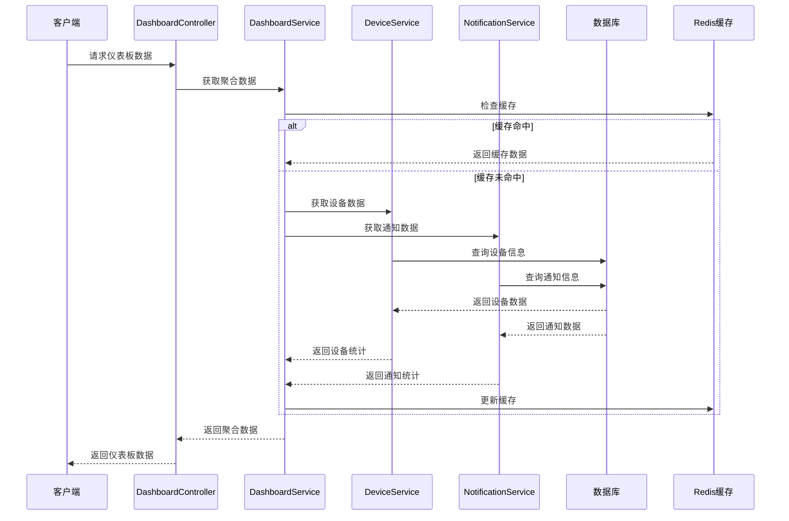
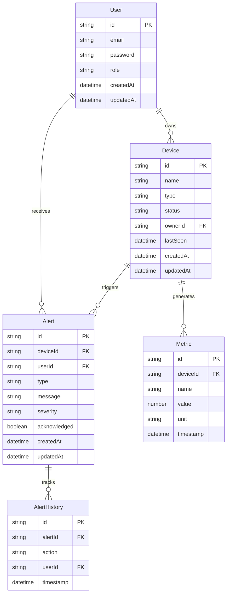

# FreeMonitor 数据流架构

## 数据流概览

本系统采用分层的数据流架构，确保数据在各层之间有序流动，同时保证数据的一致性和完整性。

## 核心数据流

### 用户认证流程



### 设备数据采集流程



### 仪表板数据聚合流程



## 数据模型

### 核心实体关系



## 数据访问模式

### Repository模式

系统采用Repository模式封装数据访问逻辑，确保业务逻辑与数据访问解耦：

```typescript
// 设备Repository示例
@Injectable()
export class DeviceRepository {
  constructor(private prisma: PrismaService) {}

  async create(data: CreateDeviceDto): Promise<Device> {
    return this.prisma.device.create({ data });
  }

  async findById(id: string): Promise<Device | null> {
    return this.prisma.device.findUnique({ where: { id } });
  }

  async findByOwner(ownerId: string): Promise<Device[]> {
    return this.prisma.device.findMany({ where: { ownerId } });
  }

  async update(id: string, data: UpdateDeviceDto): Promise<Device> {
    return this.prisma.device.update({ where: { id }, data });
  }

  async delete(id: string): Promise<Device> {
    return this.prisma.device.delete({ where: { id } });
  }
}
```

### 缓存策略

系统采用多级缓存策略提高数据访问性能：

1. **内存缓存**: 应用级别的热点数据缓存
2. **Redis缓存**: 分布式缓存，支持集群部署
3. **数据库缓存**: 数据库查询结果缓存

```typescript
// 缓存服务示例
@Injectable()
export class CacheService {
  constructor(@Inject(CACHE_MANAGER) private cacheManager: Cache) {}

  async get<T>(key: string): Promise<T | null> {
    return this.cacheManager.get<T>(key);
  }

  async set<T>(key: string, value: T, ttl?: number): Promise<void> {
    await this.cacheManager.set(key, value, ttl);
  }

  async del(key: string): Promise<void> {
    await this.cacheManager.del(key);
  }

  async invalidatePattern(pattern: string): Promise<void> {
    const keys = await this.cacheManager.store.keys(pattern);
    await Promise.all(keys.map(key => this.cacheManager.del(key)));
  }
}
```

## 数据一致性保证

### 事务管理

系统使用数据库事务确保数据一致性：

```typescript
// 事务示例
async transferDeviceOwnership(
  deviceId: string,
  fromUserId: string,
  toUserId: string
): Promise<void> {
  await this.prisma.$transaction(async (tx) => {
    // 更新设备所有者
    await tx.device.update({
      where: { id: deviceId },
      data: { ownerId: toUserId }
    });

    // 记录转移历史
    await tx.deviceTransferHistory.create({
      data: {
        deviceId,
        fromUserId,
        toUserId,
        transferredAt: new Date()
      }
    });

    // 更新用户设备计数
    await Promise.all([
      tx.user.update({
        where: { id: fromUserId },
        data: { deviceCount: { decrement: 1 } }
      }),
      tx.user.update({
        where: { id: toUserId },
        data: { deviceCount: { increment: 1 } }
      })
    ]);
  });
}
```

### 事件溯源

关键业务操作采用事件溯源模式，确保操作的可追溯性：

```typescript
// 事件存储示例
@Injectable()
export class EventStore {
  async saveEvent(event: DomainEvent): Promise<void> {
    await this.prisma.event.create({
      data: {
        id: uuid(),
        type: event.constructor.name,
        aggregateId: event.aggregateId,
        aggregateType: event.aggregateType,
        data: JSON.stringify(event),
        version: event.version,
        createdAt: new Date()
      }
    });
  }

  async getEvents(aggregateId: string): Promise<DomainEvent[]> {
    const events = await this.prisma.event.findMany({
      where: { aggregateId },
      orderBy: { version: 'asc' }
    });

    return events.map(e => JSON.parse(e.data));
  }
}
```

## 数据安全

### 数据加密

- **传输加密**: 所有API通信使用HTTPS/TLS加密
- **存储加密**: 敏感数据在数据库中使用AES-256加密存储
- **密码加密**: 用户密码使用bcrypt进行单向哈希

### 数据脱敏

在日志和监控中，敏感数据会被脱敏处理：

```typescript
// 数据脱敏示例
export class DataMasking {
  static maskEmail(email: string): string {
    const [username, domain] = email.split('@');
    const maskedUsername = username.slice(0, 2) + '*'.repeat(username.length - 2);
    return maskedUsername + '@' + domain;
  }

  static maskPhone(phone: string): string {
    return phone.replace(/(\d{3})\d{4}(\d{4})/, '$1****$2');
  }

  static maskApiKey(apiKey: string): string {
    return apiKey.slice(0, 8) + '*'.repeat(apiKey.length - 8);
  }
}
```

---

*本文档由架构文档生成器自动生成，请勿手动编辑*
