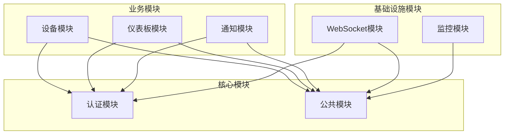

# FreeMonitor 模块架构

## 模块概览

本系统采用模块化设计，各模块职责明确，依赖关系清晰。

## 模块依赖图



## 模块详情


### auth 模块

**类型**: 核心模块  
**路径**: `src/auth`

#### 模块职责
- 用户认证和授权
- JWT令牌管理
- 密码加密和验证
- 角色权限控制

#### 模块组件

- **控制器**: AuthController

- **服务**: AuthService, MfaService


#### 依赖关系

- **依赖模块**: common


#### 模块接口
```typescript
// TODO: 添加模块接口定义
```


### devices 模块

**类型**: 功能模块  
**路径**: `src/devices`

#### 模块职责
- 设备注册和管理
- 设备状态监控
- 设备数据采集
- 设备告警处理

#### 模块组件

- **控制器**: DeviceController

- **服务**: DeviceService, MetricService


#### 依赖关系

- **依赖模块**: auth, common


#### 模块接口
```typescript
// TODO: 添加模块接口定义
```


### dashboard 模块

**类型**: 功能模块  
**路径**: `src/dashboard`

#### 模块职责
- 仪表板数据聚合
- 系统状态展示
- 性能指标统计
- 可视化图表生成

#### 模块组件

- **控制器**: DashboardController

- **服务**: DashboardService


#### 依赖关系

- **依赖模块**: auth, devices, common


#### 模块接口
```typescript
// TODO: 添加模块接口定义
```


### notification 模块

**类型**: 功能模块  
**路径**: `src/notification`

#### 模块职责
- 通知消息管理
- 多渠道消息推送
- 通知模板管理
- 消息历史记录

#### 模块组件

- **控制器**: NotificationController

- **服务**: NotificationService


#### 依赖关系

- **依赖模块**: auth, common


#### 模块接口
```typescript
// TODO: 添加模块接口定义
```


### common 模块

**类型**: 共享模块  
**路径**: `src/common`

#### 模块职责
- 公共工具函数
- 通用装饰器
- 异常过滤器
- 请求拦截器

#### 模块组件

- **服务**: CacheService, EncryptionService


#### 依赖关系


#### 模块接口
```typescript
// TODO: 添加模块接口定义
```


### websocket 模块

**类型**: 基础设施模块  
**路径**: `src/websocket`

#### 模块职责
- WebSocket连接管理
- 实时消息推送
- 客户端状态维护
- 事件广播处理

#### 模块组件

- **服务**: WebSocketGateway


#### 依赖关系

- **依赖模块**: auth, common


#### 模块接口
```typescript
// TODO: 添加模块接口定义
```


---

*本文档由架构文档生成器自动生成，请勿手动编辑*
