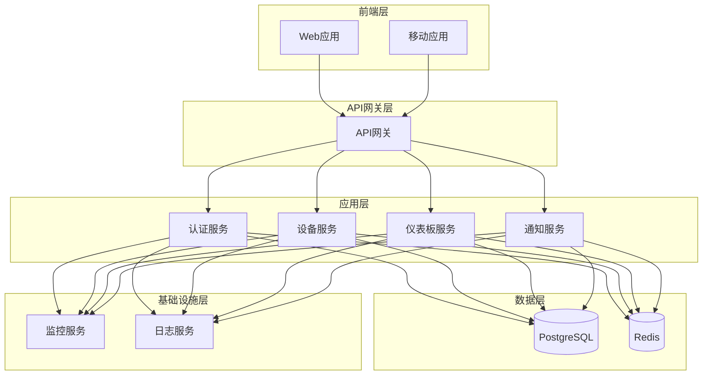

# FreeMonitor 系统架构概览

## 项目简介

免费监控系统

## 技术栈

- NestJS
- TypeScript
- Prisma
- PostgreSQL
- Redis

## 架构模式

分层架构

## 系统架构图

## 核心组件

### 前端层
- **Web应用**: 基于React的Web管理界面
- **移动应用**: 基于React Native的移动应用

### API网关层
- **API网关**: 统一入口，负责路由、认证、限流等

### 应用层
- **认证服务**: 用户认证、授权、JWT管理
- **设备服务**: 设备注册、管理、数据采集
- **仪表板服务**: 数据可视化、报表生成
- **通知服务**: 消息推送、邮件通知

### 数据层
- **PostgreSQL**: 主数据库，存储业务数据
- **Redis**: 缓存层，提高访问性能

### 基础设施层
- **监控服务**: 系统监控、性能分析
- **日志服务**: 日志收集、分析、查询

## 设计原则

1. **分层架构**: 严格的分层设计，确保职责分离
2. **微服务**: 服务拆分，独立部署、扩展
3. **API优先**: 所有功能通过API提供
4. **数据一致性**: 通过事务和事件保证数据一致性
5. **高可用**: 服务冗余、故障转移
6. **安全性**: 认证、授权、数据加密

---

*本文档由架构文档生成器自动生成，请勿手动编辑*
