# FreeMonitor 性能优化

## 性能概览

本系统采用多层次性能优化策略，从代码层面到架构层面，全面提升系统性能和用户体验。

## 性能优化架构

```mermaid
graph TB
    subgraph "前端优化"
        LAZY[懒加载]
        CACHE[缓存策略]
        BUNDLE[代码分割]
    end
    
    subgraph "网络优化"
        CDN[CDN加速]
        COMPRESS[资源压缩]
        HTTP2[HTTP/2]
    end
    
    subgraph "应用优化"
        ASYNC[异步处理]
        POOL[连接池]
        BATCH[批量处理]
    end
    
    subgraph "数据优化"
        INDEX[索引优化]
        PARTITION[数据分区]
        REDIS_CACHE[Redis缓存]
    end
    
    subgraph "基础设施优化"
        CLUSTER[集群部署]
        LB[负载均衡]
        SCALE[自动扩缩容]
    end
    
    LAZY --> CACHE
    CACHE --> BUNDLE
    
    CDN --> COMPRESS
    COMPRESS --> HTTP2
    
    ASYNC --> POOL
    POOL --> BATCH
    
    INDEX --> PARTITION
    PARTITION --> REDIS_CACHE
    
    CLUSTER --> LB
    LB --> SCALE
```



## 前端性能优化

### 代码分割和懒加载

```typescript
// 路由级别的代码分割
const Dashboard = lazy(() => import('./pages/Dashboard'));
const Devices = lazy(() => import('./pages/Devices'));
const Settings = lazy(() => import('./pages/Settings'));

function App() {
  return (
    <Router>
      <Suspense fallback={<Loading />}>
        <Routes>
          <Route path="/dashboard" element={<Dashboard />} />
          <Route path="/devices" element={<Devices />} />
          <Route path="/settings" element={<Settings />} />
        </Routes>
      </Suspense>
    </Router>
  );
}
```

### 组件级别的懒加载

```typescript
// 组件懒加载
const HeavyComponent = lazy(() => import('./HeavyComponent'));

function ParentComponent() {
  const [showHeavy, setShowHeavy] = useState(false);
  
  return (
    <div>
      <button onClick={() => setShowHeavy(true)}>
        加载重型组件
      </button>
      
      {showHeavy && (
        <Suspense fallback={<Loading />}>
          <HeavyComponent />
        </Suspense>
      )}
    </div>
  );
}
```

### 虚拟滚动

```typescript
// 虚拟滚动组件
import { FixedSizeList as List } from 'react-window';

const VirtualizedList = ({ items }) => {
  const Row = ({ index, style }) => (
    <div style={style}>
      {items[index].content}
    </div>
  );

  return (
    <List
      height={600}
      itemCount={items.length}
      itemSize={50}
      width="100%"
    >
      {Row}
    </List>
  );
};
```

## 后端性能优化

### 数据库查询优化

```typescript
// 分页查询优化
@Injectable()
export class DeviceService {
  async findDevices(pagination: PaginationDto): Promise<PaginatedResult<Device>> {
    const { page, limit, cursor } = pagination;
    
    // 使用游标分页替代OFFSET
    const devices = await this.prisma.device.findMany({
      take: limit + 1, // 多取一条判断是否有下一页
      cursor: cursor ? { id: cursor } : undefined,
      orderBy: { id: 'asc' },
      include: {
        owner: {
          select: {
            id: true,
            name: true,
            email: true
          }
        }
      }
    });

    const hasMore = devices.length > limit;
    const items = hasMore ? devices.slice(0, -1) : devices;
    const nextCursor = hasMore ? items[items.length - 1].id : null;

    return {
      items,
      nextCursor,
      hasMore
    };
  }
}
```

### 批量处理

```typescript
// 批量插入优化
@Injectable()
export class MetricService {
  async saveMetrics(metrics: CreateMetricDto[]): Promise<void> {
    // 使用事务批量插入
    await this.prisma.$transaction(async (tx) => {
      // 分批处理，避免单次事务过大
      const batchSize = 1000;
      for (let i = 0; i < metrics.length; i += batchSize) {
        const batch = metrics.slice(i, i + batchSize);
        await tx.metric.createMany({
          data: batch
        });
      }
    });
  }
}
```

### 连接池优化

```typescript
// 数据库连接池配置
const prisma = new PrismaClient({
  datasources: {
    db: {
      url: process.env.DATABASE_URL,
    },
  },
  log: ['query', 'info', 'warn', 'error'],
  // 连接池配置
  __internal: {
    engine: {
      // 连接池大小
      connectionLimit: 20,
      // 连接超时
      connectTimeout: 10000,
      // 查询超时
      queryTimeout: 30000,
    },
  },
});
```

## 缓存策略

### 多级缓存

```typescript
// 多级缓存实现
@Injectable()
export class MultiLevelCacheService {
  private memoryCache = new Map<string, { data: any; expiry: number }>();

  constructor(
    @Inject(CACHE_MANAGER) private redisCache: Cache,
    private prisma: PrismaService
  ) {}

  async get<T>(key: string): Promise<T | null> {
    // 1. 检查内存缓存
    const memoryItem = this.memoryCache.get(key);
    if (memoryItem && memoryItem.expiry > Date.now()) {
      return memoryItem.data;
    }

    // 2. 检查Redis缓存
    const redisItem = await this.redisCache.get<T>(key);
    if (redisItem) {
      // 回填内存缓存
      this.memoryCache.set(key, {
        data: redisItem,
        expiry: Date.now() + 5 * 60 * 1000 // 5分钟
      });
      return redisItem;
    }

    // 3. 从数据库获取
    const dbItem = await this.fetchFromDatabase<T>(key);
    if (dbItem) {
      // 设置Redis缓存
      await this.redisCache.set(key, dbItem, 60 * 60); // 1小时
      // 设置内存缓存
      this.memoryCache.set(key, {
        data: dbItem,
        expiry: Date.now() + 5 * 60 * 1000 // 5分钟
      });
    }

    return dbItem;
  }

  private async fetchFromDatabase<T>(key: string): Promise<T | null> {
    // 根据key从数据库获取数据
    // 实现略...
    return null;
  }
}
```

### 缓存预热

```typescript
// 缓存预热服务
@Injectable()
export class CacheWarmupService {
  constructor(
    private cacheService: MultiLevelCacheService,
    private deviceService: DeviceService,
    private dashboardService: DashboardService
  ) {}

  async warmupCache(): Promise<void> {
    console.log('开始缓存预热...');
    
    // 预热热门设备数据
    const popularDevices = await this.deviceService.findPopularDevices(100);
    await Promise.all(
      popularDevices.map(device => 
        this.cacheService.set(`device:${device.id}`, device)
      )
    );

    // 预热仪表板数据
    const dashboardData = await this.dashboardService.getAggregatedData();
    await this.cacheService.set('dashboard:aggregated', dashboardData);
    
    console.log('缓存预热完成');
  }
}
```

## 异步处理

### 消息队列

```typescript
// 消息队列配置
@Module({
  imports: [
    BullModule.forRoot({
      redis: {
        host: process.env.REDIS_HOST,
        port: parseInt(process.env.REDIS_PORT || '6379'),
      },
    }),
    BullModule.registerQueue({
      name: 'notification',
    }),
    BullModule.registerQueue({
      name: 'report',
    }),
  ],
})
export class QueueModule {}

// 队列处理器
@Processor('notification')
export class NotificationProcessor {
  constructor(private notificationService: NotificationService) {}

  @Process('send-email')
  async handleSendEmail(job: Job<EmailJob>) {
    const { to, subject, template, data } = job.data;
    
    try {
      await this.notificationService.sendEmail(to, subject, template, data);
    } catch (error) {
      throw new Error(`发送邮件失败: ${error.message}`);
    }
  }
}
```

### 后台任务

```typescript
// 后台任务调度
@Injectable()
export class TaskSchedulerService {
  constructor(
    @InjectQueue('notification') private notificationQueue: Queue,
    @InjectQueue('report') private reportQueue: Queue
  ) {}

  @Cron('0 0 * * *') // 每天午夜执行
  async generateDailyReport() {
    await this.reportQueue.add('generate-daily', {
      reportType: 'daily',
      date: new Date(),
    });
  }

  @Cron('0 8 * * 1') // 每周一早上8点执行
  async sendWeeklySummary() {
    await this.notificationQueue.add('send-weekly-summary', {
      type: 'weekly',
      date: new Date(),
    });
  }
}
```

## 监控和性能分析

### 性能指标收集

```typescript
// 性能监控中间件
@Injectable()
export class PerformanceMiddleware implements NestMiddleware {
  use(req: Request, res: Response, next: NextFunction) {
    const startTime = Date.now();
    
    res.on('finish', () => {
      const duration = Date.now() - startTime;
      
      // 记录性能指标
      this.recordMetrics({
        method: req.method,
        url: req.url,
        statusCode: res.statusCode,
        duration,
        timestamp: new Date(),
      });
    });
    
    next();
  }

  private recordMetrics(metrics: PerformanceMetrics) {
    // 发送到监控系统
    // 实现略...
  }
}
```

### APM集成

```typescript
// APM集成
import * as apm from 'elastic-apm-node';

// 初始化APM
apm.start({
  serviceName: 'freemonitor-api',
  secretToken: process.env.ELASTIC_APM_SECRET_TOKEN,
  serverUrl: process.env.ELASTIC_APM_SERVER_URL,
  environment: process.env.NODE_ENV,
});

// 自定义事务追踪
@Injectable()
export class ApmService {
  startTransaction(name: string, type: string) {
    return apm.startTransaction(name, type);
  }

  setCustomContext(context: any) {
    apm.setCustomContext(context);
  }

  captureError(error: Error) {
    apm.captureError(error);
  }
}
```

## 性能测试

### 负载测试

```typescript
// 负载测试脚本
import { check, sleep } from 'k6';
import http from 'k6/http';

export let options = {
  stages: [
    { duration: '2m', target: 100 }, // 2分钟内增加到100用户
    { duration: '5m', target: 100 }, // 保持100用户5分钟
    { duration: '2m', target: 200 }, // 2分钟内增加到200用户
    { duration: '5m', target: 200 }, // 保持200用户5分钟
    { duration: '2m', target: 0 },   // 2分钟内减少到0用户
  ],
};

export default function() {
  let response = http.get('https://api.freemonitor.com/devices');
  
  check(response, {
    'status is 200': (r) => r.status === 200,
    'response time < 500ms': (r) => r.timings.duration < 500,
  });
  
  sleep(1);
}
```

---

*本文档由架构文档生成器自动生成，请勿手动编辑*
