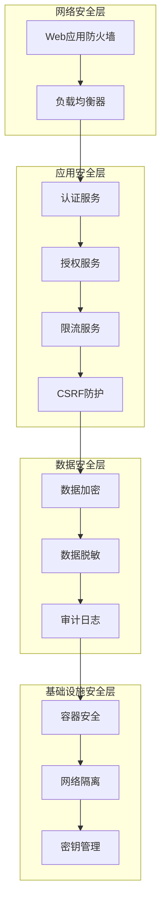

# FreeMonitor 安全架构

## 安全概览

本系统采用多层安全防护策略，从网络层到应用层，全面保护系统和数据安全。

## 安全架构图



## 认证和授权

### JWT认证

```typescript
// JWT策略实现
@Injectable()
export class JwtStrategy extends PassportStrategy(Strategy) {
  constructor(
    private configService: ConfigService,
    private userService: UserService
  ) {
    super({
      jwtFromRequest: ExtractJwt.fromAuthHeaderAsBearerToken(),
      ignoreExpiration: false,
      secretOrKey: configService.get<string>('JWT_SECRET'),
    });
  }

  async validate(payload: JwtPayload): Promise<User> {
    const user = await this.userService.findById(payload.sub);
    if (!user) {
      throw new UnauthorizedException('用户不存在');
    }
    
    // 检查用户状态
    if (!user.isActive) {
      throw new UnauthorizedException('用户已被禁用');
    }
    
    return user;
  }
}
```

### 基于角色的访问控制

```typescript
// 角色守卫实现
@Injectable()
export class RolesGuard implements CanActivate {
  constructor(private reflector: Reflector) {}

  canActivate(context: ExecutionContext): boolean {
    const requiredRoles = this.reflector.getAllAndOverride<Role[]>(ROLES_KEY, [
      context.getHandler(),
      context.getClass(),
    ]);

    if (!requiredRoles) {
      return true;
    }

    const { user } = context.switchToHttp().getRequest();
    return requiredRoles.some((role) => user.roles?.includes(role));
  }
}

// 角色装饰器
export const Roles = (...roles: Role[]) => SetMetadata(ROLES_KEY, roles);

// 使用示例
@Post()
@Roles(Role.Admin)
@UseGuards(JwtAuthGuard, RolesGuard)
createDevice(@Body() createDeviceDto: CreateDeviceDto) {
  return this.deviceService.create(createDeviceDto);
}
```

### 多因素认证

```typescript
// 多因素认证服务
@Injectable()
export class MfaService {
  async generateTotpSecret(user: User): Promise<string> {
    const secret = authenticator.generateSecret();
    await this.userService.updateMfaSecret(user.id, secret);
    return secret;
  }

  async generateQrCode(secret: string, email: string): Promise<string> {
    const otpauthUrl = authenticator.keyuri(email, 'FreeMonitor', secret);
    return toDataURL(otpauthUrl);
  }

  async verifyTotpToken(secret: string, token: string): Promise<boolean> {
    return authenticator.verify({ token, secret });
  }

  async enableMfa(userId: string, token: string): Promise<void> {
    const user = await this.userService.findById(userId);
    if (!user.mfaSecret) {
      throw new BadRequestException('MFA未设置');
    }

    const isValid = await this.verifyTotpToken(user.mfaSecret, token);
    if (!isValid) {
      throw new UnauthorizedException('无效的MFA令牌');
    }

    await this.userService.enableMfa(userId);
  }
}
```

## 数据保护

### 数据加密

```typescript
// 敏感数据加密服务
@Injectable()
export class EncryptionService {
  private readonly algorithm = 'aes-256-gcm';
  private readonly keyLength = 32;

  constructor(
    @Inject('ENCRYPTION_KEY') private readonly encryptionKey: string
  ) {}

  encrypt(text: string): { encrypted: string; iv: string; tag: string } {
    const iv = crypto.randomBytes(16);
    const cipher = crypto.createCipher(this.algorithm, this.encryptionKey);
    cipher.setAAD(Buffer.from('freemonitor', 'utf8'));
    
    let encrypted = cipher.update(text, 'utf8', 'hex');
    encrypted += cipher.final('hex');
    
    const tag = cipher.getAuthTag();
    
    return {
      encrypted,
      iv: iv.toString('hex'),
      tag: tag.toString('hex')
    };
  }

  decrypt(encryptedData: {
    encrypted: string;
    iv: string;
    tag: string;
  }): string {
    const decipher = crypto.createDecipher(this.algorithm, this.encryptionKey);
    decipher.setAAD(Buffer.from('freemonitor', 'utf8'));
    decipher.setAuthTag(Buffer.from(encryptedData.tag, 'hex'));
    
    let decrypted = decipher.update(encryptedData.encrypted, 'hex', 'utf8');
    decrypted += decipher.final('utf8');
    
    return decrypted;
  }
}
```

### 数据脱敏

```typescript
// 数据脱敏拦截器
@Injectable()
export class DataMaskingInterceptor implements NestInterceptor {
  intercept(context: ExecutionContext, next: CallHandler): Observable<any> {
    return next.handle().pipe(
      map(data => this.maskSensitiveData(data))
    );
  }

  private maskSensitiveData(data: any): any {
    if (!data) return data;

    if (Array.isArray(data)) {
      return data.map(item => this.maskSensitiveData(item));
    }

    if (typeof data === 'object') {
      const masked = { ...data };
      
      // 脱敏邮箱
      if (masked.email) {
        masked.email = this.maskEmail(masked.email);
      }
      
      // 脱敏手机号
      if (masked.phone) {
        masked.phone = this.maskPhone(masked.phone);
      }
      
      // 脱敏身份证号
      if (masked.idCard) {
        masked.idCard = this.maskIdCard(masked.idCard);
      }
      
      // 脱敏银行卡号
      if (masked.bankCard) {
        masked.bankCard = this.maskBankCard(masked.bankCard);
      }
      
      return masked;
    }

    return data;
  }

  private maskEmail(email: string): string {
    const [username, domain] = email.split('@');
    const maskedUsername = username.slice(0, 2) + '*'.repeat(username.length - 2);
    return maskedUsername + '@' + domain;
  }

  private maskPhone(phone: string): string {
    return phone.replace(/(\d{3})\d{4}(\d{4})/, '$1****$2');
  }

  private maskIdCard(idCard: string): string {
    return idCard.replace(/(\d{6})\d{8}(\d{4})/, '$1********$2');
  }

  private maskBankCard(bankCard: string): string {
    return bankCard.replace(/(\d{4})\d+(\d{4})/, '$1****$2');
  }
}
```

## API安全

### 请求验证

```typescript
// 请求验证管道
@Injectable()
export class ValidationPipe implements PipeTransform {
  async transform(value: any, { metatype }: ArgumentMetadata) {
    if (!metatype || !this.toValidate(metatype)) {
      return value;
    }

    const object = plainToInstance(metatype, value);
    const errors = await validate(object);

    if (errors.length > 0) {
      const errorMessages = errors.map(error => {
        const constraints = Object.values(error.constraints || {});
        return constraints.join(', ');
      });
      
      throw new BadRequestException({
        message: '输入验证失败',
        errors: errorMessages
      });
    }

    return object;
  }

  private toValidate(metatype: Function): boolean {
    const types: Function[] = [String, Boolean, Number, Array, Object];
    return !types.includes(metatype);
  }
}
```

### SQL注入防护

```typescript
// 安全查询构建器
@Injectable()
export class SafeQueryBuilder {
  constructor(private prisma: PrismaService) {}

  async findUsers(filters: UserFilters): Promise<User[]> {
    const where: any = {};

    // 安全的字符串过滤
    if (filters.name) {
      where.name = {
        contains: filters.name,
        mode: 'insensitive'
      };
    }

    // 安全的ID过滤
    if (filters.id) {
      where.id = filters.id;
    }

    // 安全的枚举过滤
    if (filters.status) {
      where.status = filters.status;
    }

    // 安全的日期范围过滤
    if (filters.dateFrom || filters.dateTo) {
      where.createdAt = {};
      if (filters.dateFrom) {
        where.createdAt.gte = new Date(filters.dateFrom);
      }
      if (filters.dateTo) {
        where.createdAt.lte = new Date(filters.dateTo);
      }
    }

    return this.prisma.user.findMany({ where });
  }
}
```

### XSS防护

```typescript
// XSS防护中间件
@Injectable()
export class XssProtectionMiddleware implements NestMiddleware {
  use(req: Request, res: Response, next: NextFunction) {
    // 设置XSS防护头
    res.setHeader('X-XSS-Protection', '1; mode=block');
    res.setHeader('X-Content-Type-Options', 'nosniff');
    res.setHeader('X-Frame-Options', 'DENY');
    res.setHeader('Content-Security-Policy', "default-src 'self'");

    // 清理请求数据
    if (req.body) {
      req.body = this.sanitizeInput(req.body);
    }

    if (req.query) {
      req.query = this.sanitizeInput(req.query);
    }

    next();
  }

  private sanitizeInput(input: any): any {
    if (typeof input === 'string') {
      return this.sanitizeString(input);
    }

    if (Array.isArray(input)) {
      return input.map(item => this.sanitizeInput(item));
    }

    if (typeof input === 'object' && input !== null) {
      const sanitized: any = {};
      for (const key in input) {
        sanitized[key] = this.sanitizeInput(input[key]);
      }
      return sanitized;
    }

    return input;
  }

  private sanitizeString(str: string): string {
    return str
      .replace(/<script\b[^<]*(?:(?!<\/script>)<[^<]*)*<\/script>/gi, '')
      .replace(/<iframe\b[^<]*(?:(?!<\/iframe>)<[^<]*)*<\/iframe>/gi, '')
      .replace(/javascript:/gi, '')
      .replace(/on\w+\s*=/gi, '');
  }
}
```

## 网络安全

### HTTPS配置

```typescript
// HTTPS服务器配置
async function bootstrap() {
  const app = await NestFactory.create(AppModule);
  
  // HTTPS配置
  const httpsOptions = {
    key: fs.readFileSync('./ssl/private-key.pem'),
    cert: fs.readFileSync('./ssl/certificate.pem'),
    ca: fs.readFileSync('./ssl/ca-bundle.pem'),
  };

  await app.listen(3000, '0.0.0.0', httpsOptions);
}
```

### CORS配置

```typescript
// CORS配置
@Injectable()
export class CorsConfig {
  static getOptions(): CorsOptions {
    return {
      origin: (origin, callback) => {
        const allowedOrigins = [
          'https://app.freemonitor.com',
          'https://admin.freemonitor.com'
        ];

        if (!origin || allowedOrigins.includes(origin)) {
          callback(null, true);
        } else {
          callback(new Error('不允许的CORS来源'));
        }
      },
      credentials: true,
      methods: ['GET', 'POST', 'PUT', 'DELETE', 'PATCH'],
      allowedHeaders: ['Content-Type', 'Authorization'],
      maxAge: 86400, // 24小时
    };
  }
}
```

### 限流配置

```typescript
// 限流配置
@Module({
  imports: [
    ThrottlerModule.forRoot([
      {
        name: 'default',
        ttl: 60000, // 1分钟
        limit: 100, // 100次请求
      },
      {
        name: 'auth',
        ttl: 60000, // 1分钟
        limit: 5,   // 5次登录尝试
      },
      {
        name: 'password-reset',
        ttl: 900000, // 15分钟
        limit: 3,    // 3次密码重置
      },
    ]),
  ],
})
export class AppModule {}
```

## 安全监控

### 安全事件日志

```typescript
// 安全事件日志服务
@Injectable()
export class SecurityAuditService {
  constructor(
    @Inject('SECURITY_LOGGER') private readonly logger: Logger
  ) {}

  logAuthEvent(event: AuthEvent): void {
    this.logger.log('auth', {
      type: event.type,
      userId: event.userId,
      ip: event.ip,
      userAgent: event.userAgent,
      timestamp: new Date(),
      success: event.success,
      reason: event.reason,
    });
  }

  logDataAccessEvent(event: DataAccessEvent): void {
    this.logger.log('data_access', {
      type: event.type,
      userId: event.userId,
      resource: event.resource,
      action: event.action,
      ip: event.ip,
      timestamp: new Date(),
    });
  }

  logSecurityViolation(event: SecurityViolationEvent): void {
    this.logger.warn('security_violation', {
      type: event.type,
      userId: event.userId,
      ip: event.ip,
      description: event.description,
      severity: event.severity,
      timestamp: new Date(),
    });
  }
}
```

### 异常检测

```typescript
// 异常行为检测服务
@Injectable()
export class AnomalyDetectionService {
  constructor(
    private redisService: RedisService,
    private notificationService: NotificationService
  ) {}

  async detectSuspiciousActivity(userId: string, activity: UserActivity): Promise<void> {
    const key = 'user_activity:' + userId;
    const recentActivities = await this.redisService.lrange(key, 0, 9);

    // 检测异常登录位置
    if (activity.type === 'login') {
      const recentLogins = recentActivities
        .filter(a => a.type === 'login')
        .map(a => JSON.parse(a));

      if (this.isUnusualLocation(activity.ip, recentLogins)) {
        await this.notificationService.sendSecurityAlert({
          userId,
          type: 'unusual_location',
          details: activity.ip,
        });
      }
    }

    // 检测异常访问频率
    if (this.isUnusualFrequency(recentActivities)) {
      await this.notificationService.sendSecurityAlert({
        userId,
        type: 'unusual_frequency',
        details: activity,
      });
    }

    // 记录活动
    await this.redisService.lpush(key, JSON.stringify(activity));
    await this.redisService.expire(key, 3600); // 1小时过期
  }

  private isUnusualLocation(currentIp: string, recentLogins: any[]): boolean {
    if (recentLogins.length === 0) return false;

    const recentIps = recentLogins.map(login => login.ip);
    return !recentIps.includes(currentIp);
  }

  private isUnusualFrequency(activities: string[]): boolean {
    return activities.length > 50; // 1小时内超过50次活动
  }
}
```

---

*本文档由架构文档生成器自动生成，请勿手动编辑*
