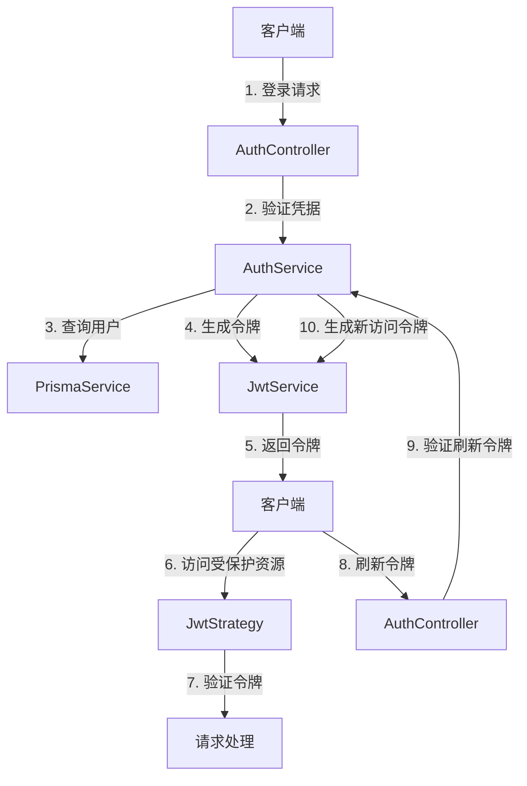

# 认证系统架构设计

## 目录结构
- [概述](#概述)
- [架构图](#架构图)
- [组件说明](#组件说明)
- [认证流程](#认证流程)
- [安全考虑](#安全考虑)
- [JWT令牌结构](#jwt令牌结构)
- [刷新令牌机制](#刷新令牌机制)
- [权限控制](#权限控制)

## 概述

本文档详细描述了FreeMonitor应用的认证系统架构设计，包括JWT令牌机制、刷新令牌流程、权限控制等核心组件。

## 架构图



## 组件说明

### AuthController
处理认证相关的HTTP请求：
- 用户登录 `/api/auth/login`
- 用户注册 `/api/auth/register`
- 刷新令牌 `/api/auth/refresh`
- 密码重置 `/api/auth/forgot-password` 和 `/api/auth/reset-password`

### AuthService
认证服务核心逻辑：
- 验证用户凭据
- 生成和验证JWT令牌
- 管理刷新令牌
- 处理密码重置流程

### JwtStrategy
JWT验证策略：
- 从请求头提取JWT
- 验证JWT有效性
- 将用户信息附加到请求对象

### DevAuthGuard
开发环境认证守卫：
- 在开发环境中自动注入测试用户
- 简化开发和测试流程

### RolesGuard
角色权限守卫：
- 验证用户角色权限
- 控制对受保护资源的访问

## 认证流程

### 用户登录
1. 客户端发送邮箱和密码到 `/api/auth/login`
2. AuthController调用AuthService验证凭据
3. AuthService查询数据库验证用户
4. 如果验证成功，AuthService生成JWT访问令牌和刷新令牌
5. 返回令牌给客户端

### 访问受保护资源
1. 客户端在Authorization头中包含JWT令牌
2. JwtStrategy拦截请求并验证令牌
3. 如果令牌有效，将用户信息附加到请求对象
4. 控制器处理请求并返回响应

### 刷新令牌
1. 客户端发送刷新令牌到 `/api/auth/refresh`
2. AuthController调用AuthService验证刷新令牌
3. 如果令牌有效，生成新的访问令牌
4. 返回新的访问令牌给客户端

## 安全考虑

### 密码安全
- 使用bcrypt进行密码哈希
- 密码强度验证（最小8字符，包含大小写字母、数字和特殊字符）
- 防止暴力破解（账户锁定机制）

### 令牌安全
- JWT签名密钥保护
- 令牌过期时间设置
- 刷新令牌存储在数据库中
- 刷新令牌黑名单机制

### 传输安全
- 强制使用HTTPS
- 设置安全的Cookie属性（HttpOnly, Secure）
- CORS配置限制

## JWT令牌结构

### 访问令牌Payload
```json
{
  "sub": "用户ID",
  "email": "用户邮箱",
  "role": "用户角色",
  "iat": "签发时间",
  "exp": "过期时间"
}
```

### 刷新令牌
- 存储在数据库中
- 与用户ID关联
- 包含过期时间
- 支持撤销机制

## 刷新令牌机制

### 存储
刷新令牌存储在数据库的`refresh_tokens`表中，包含以下字段：
- `id`: 主键
- `token`: 令牌值
- `userId`: 关联用户ID
- `expiresAt`: 过期时间
- `revoked`: 是否已撤销

### 流程
1. 登录时生成刷新令牌并存储到数据库
2. 刷新时验证令牌有效性
3. 验证通过后生成新的访问令牌
4. 原刷新令牌可选择是否继续使用或替换

### 撤销
- 用户登出时撤销刷新令牌
- 令牌过期时自动清理
- 支持手动撤销特定令牌

## 权限控制

### 角色定义
- `ADMIN`: 管理员，拥有所有权限
- `USER`: 普通用户，拥有基本权限
- `VIEWER`: 查看者，只读权限

### 权限分配
- 基于角色的访问控制（RBAC）
- 路由级别权限控制
- 细粒度资源权限控制

### 权限验证
- 使用`@Roles()`装饰器定义路由权限
- RolesGuard在请求处理前验证权限
- 未授权访问返回403 Forbidden状态码

---
*最后更新: 2025-09-25*
*作者: 架构团队*