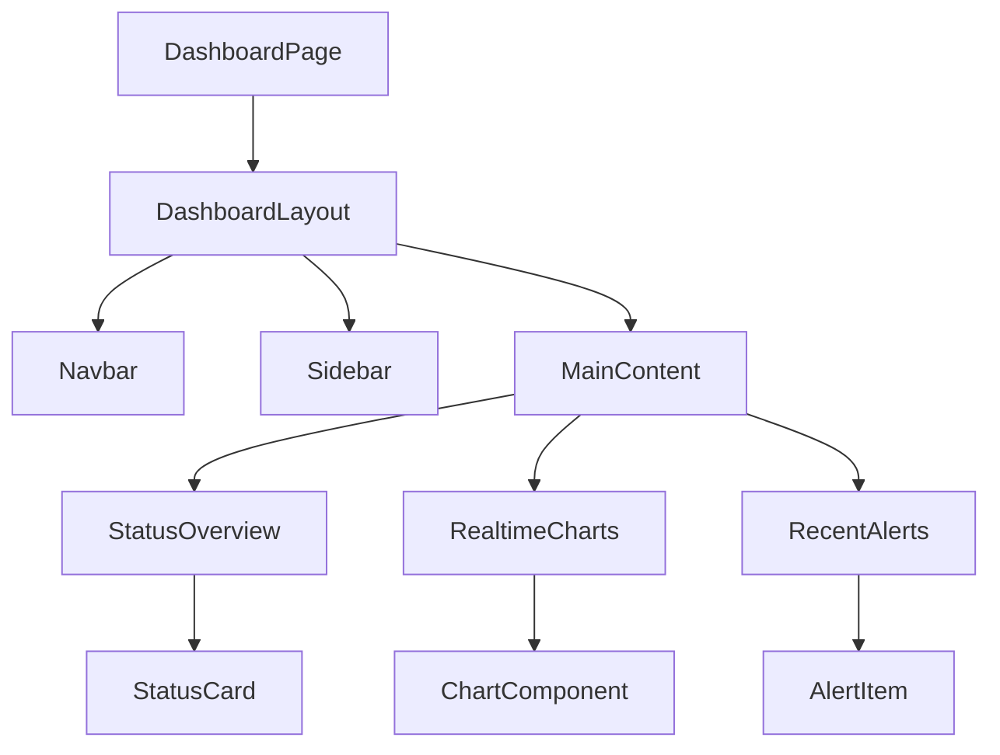

# 仪表盘UI架构设计

## 目录结构
- [概述](#概述)
- [架构图](#架构图)
- [组件结构](#组件结构)
- [数据流](#数据流)
- [状态管理](#状态管理)
- [图表实现](#图表实现)
- [实时数据处理](#实时数据处理)
- [性能优化](#性能优化)

## 概述

本文档详细描述了FreeMonitor应用仪表盘UI的架构设计，包括组件结构、数据流、状态管理、图表实现等核心组件。

## 架构图

## 组件结构

### DashboardPage
仪表盘页面根组件：
- 管理整体布局
- 协调各子组件数据获取
- 处理页面级状态

### DashboardLayout
仪表盘布局组件：
- 提供页面框架结构
- 包含导航栏、侧边栏和主内容区域
- 处理响应式布局

### Navbar
导航栏组件：
- 显示应用标题和用户信息
- 提供全局导航链接
- 包含用户菜单和登出功能

### Sidebar
侧边栏组件：
- 提供应用功能导航
- 显示当前用户角色相关的菜单项
- 支持折叠和展开

### MainContent
主内容区域：
- 包含状态概览、实时图表和最近告警面板
- 协调子组件间的数据流
- 处理页面刷新和数据更新

### StatusOverview
状态概览组件：
- 显示关键指标卡片
- 实现自动刷新机制
- 处理加载和错误状态

### RealtimeCharts
实时图表组件：
- 显示设备指标数据图表
- 实现WebSocket数据流
- 提供时间范围选择和图表类型切换

### RecentAlerts
最近告警组件：
- 显示最新告警列表
- 实现分页和过滤功能
- 提供告警详情查看

## 数据流

### 初始化数据获取
1. DashboardPage组件挂载
2. 并行获取状态概览、图表数据和告警数据
3. 将数据传递给相应子组件
4. 子组件渲染数据

### 实时数据更新
1. 建立WebSocket连接
2. 监听实时数据流
3. 接收数据更新事件
4. 更新组件状态和UI

### 用户交互数据流
1. 用户操作（如刷新、过滤）
2. 触发相应API调用
3. 更新组件状态
4. 重新渲染UI

## 状态管理

### 组件级状态
- 使用React useState管理组件内部状态
- 处理加载、错误和数据状态
- 实现局部状态优化

### 全局状态
- 使用useAuth管理认证状态
- 使用useDevices管理设备数据
- 使用useAlerts管理告警数据

### 缓存策略
- 实现数据缓存减少重复请求
- 设置合理的缓存过期时间
- 支持缓存失效和更新

## 图表实现

### 图表库选择
- 使用ECharts作为主要图表库
- 选择WebGL渲染器提高性能
- 支持响应式设计

### 图表组件封装
- 封装通用图表组件
- 提供统一的配置接口
- 实现图表交互功能

### 数据可视化
- 支持折线图、柱状图、面积图
- 实现数据缩放和平移
- 提供数据点悬停详情

## 实时数据处理

### WebSocket连接
- 建立稳定WebSocket连接
- 实现自动重连机制
- 处理连接错误和异常

### 数据订阅
- 支持按设备和指标类型订阅
- 实现订阅管理
- 处理订阅取消

### 数据更新
- 实时接收数据更新
- 更新图表和状态显示
- 处理数据积压和延迟

## 性能优化

### 渲染优化
- 使用React.memo优化组件渲染
- 实现虚拟滚动处理大量数据
- 减少不必要的重渲染

### 数据优化
- 实现数据分页减少内存占用
- 使用数据压缩减少传输量
- 缓存历史数据提高响应速度

### 加载优化
- 实现骨架屏提高用户体验
- 使用懒加载减少初始加载时间
- 预加载关键数据

---
*最后更新: 2025-09-25*
*作者: 前端团队*