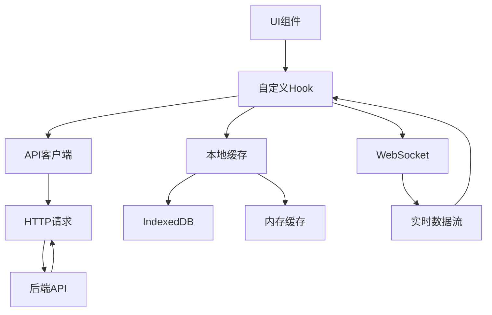

# 状态管理架构设计

## 目录结构
- [概述](#概述)
- [架构图](#架构图)
- [Hook设计](#hook设计)
- [缓存策略](#缓存策略)
- [数据同步](#数据同步)
- [性能优化](#性能优化)
- [错误处理](#错误处理)

## 概述

本文档详细描述了FreeMonitor应用的状态管理架构设计，包括自定义Hook设计、缓存策略、数据同步机制、性能优化和错误处理等核心组件。

## 架构图

## Hook设计

### useAuth Hook
管理用户认证状态：
- 登录和登出功能
- 访问令牌和刷新令牌管理
- 用户信息存储和更新
- 认证状态检查

### useDevices Hook
管理设备数据：
- 设备列表获取和过滤
- 设备详情查询
- 设备创建、更新和删除
- 设备状态实时更新

### useAlerts Hook
管理告警数据：
- 告警列表获取和分页
- 告警详情查询
- 告警确认和解决
- 告警状态实时更新

### useMetrics Hook
管理指标数据：
- 指标数据获取和聚合
- 实时数据订阅
- 历史数据查询
- 数据缓存管理

## 缓存策略

### 多级缓存
1. **内存缓存**：存储最近访问的数据，提供最快访问速度
2. **IndexedDB缓存**：持久化存储大量数据，支持离线访问
3. **HTTP缓存**：利用浏览器HTTP缓存机制

### 缓存键设计
- 使用URL和查询参数生成缓存键
- 支持缓存键的版本控制
- 实现缓存键的命名空间隔离

### 缓存失效
- 基于时间的缓存失效（TTL）
- 基于事件的缓存失效（数据更新时）
- 手动缓存失效（特定操作时）

### 缓存更新
- 写时更新策略
- 读时更新策略
- 后台预热策略

## 数据同步

### 初始化同步
1. 组件挂载时检查缓存数据
2. 如果缓存有效，直接使用缓存数据
3. 同时发起网络请求获取最新数据
4. 网络请求完成后更新缓存和UI

### 实时同步
1. 建立WebSocket连接
2. 订阅相关数据变更事件
3. 接收实时更新并更新缓存
4. 通知相关组件更新UI

### 冲突解决
- 使用时间戳解决数据冲突
- 优先使用服务器数据
- 支持手动解决冲突

## 性能优化

### 请求优化
- 实现请求去重避免重复请求
- 支持请求批处理减少网络开销
- 实现请求优先级管理

### 数据优化
- 实现数据分页减少内存占用
- 使用数据压缩减少传输量
- 支持数据懒加载

### 渲染优化
- 使用React.memo优化组件渲染
- 实现虚拟滚动处理大量数据
- 减少不必要的重渲染

## 错误处理

### 网络错误
- 自动重试机制
- 错误分类和处理
- 用户友好的错误提示

### 数据错误
- 数据验证和清洗
- 错误数据的隔离和恢复
- 数据一致性保证

### 缓存错误
- 缓存读写错误处理
- 缓存损坏检测和修复
- 缓存容量管理

---
*最后更新: 2025-09-25*
*作者: 前端团队*